# CLI Password Manager

**Introduction:**
The goal was to write a password manager in Python that allows users to create, save, retrieve, and manage passwords.

**Key Features**
- Creating, saving, and retrieving passwords
- Creating password entries, each with a title, a description, and a password

how to?
pip install -r requirements.txt

  

